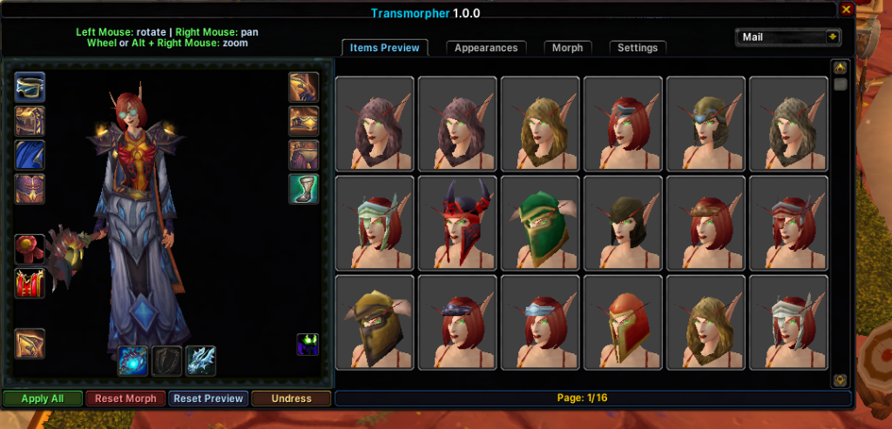

# Transmorpher (3.3.5a)

A high-performance **transmog addon and morpher** for World of Warcraft 3.3.5a (12340).

## What it does
Transmorpher is a powerful tool that gives you complete control over your character's visual appearance. It allows you to change how you look to yourself without affecting your actual gear, stats, or other players.

### Key Features:
- **Item Morphing**: Instantly change any armor or weapon slot to any item in the game database.
- **Character Morphing**: Morph into any race, gender, NPC, or legendary creature (Lich King, Illidan, etc.).
- **Mount Morphing**: Change your mount's appearance to any mount in the WotLK database.
- **Pet Morphing**: Morph your non-combat pet into any critter from the full WotLK database.
- **Combat Pet Morphing**: Morph your DK, Hunter, or Warlock pet into any combat pet or creature. Supports search by name or ID, with adjustable pet size.
- **Visual Customization**: Adjust your character's scale and size.
- **Save System**: Create your favorite "Looks" and save them.
- **Per-Character Persistence**: Your transmogs, morphs, mount, pet, and combat pet morphs are saved per character and automatically loaded every time you open the game.
- **Native UI**: Includes a modern golden-themed interface and a draggable "Transmog" button directly on your character frame.

## Installation
1. **DLL**: Place `dinput8.dll` in your WoW folder (next to `Wow.exe`).
2. **Addon**: Place the `Transmorpher` folder in your `Interface\AddOns\` directory.

## How to Use
- Open the interface with `/morph` or `/vm`.
- Use the **Transmog** button on your character frame.
- **Left-click** items to preview.
- **Alt + Left-click** slots to apply morphs.
- Use the **Morph** tab for race, scale changes, and creature search.
- Use the **Mounts** tab to change your mount appearance.
- Use the **Pets** tab to change your non-combat pet appearance.
- Use the **Combat Pets** tab to morph your DK/Hunter/Warlock pet.

## Releases
Check the [Releases](https://github.com/Kirazul/Transmorpher/releases) section for:
- Pre-compiled `dinput8.dll`.
- Ready-to-use `Transmorpher` Addon.
- Full Source Code.

## Changelog (1.0.3)
- **Draggable Character Info Button**: The Transmog button on your character frame is now draggable (Right Click + Left Click to move it).
- **Appearance Tab Improvements**: Improved the Appearance tab with an appearance preview panel.
- **Mount Morphing**: Added mount morphing with the full WotLK mount database.
- **Non-Combat Pet Morphing**: Added non-combat pet morphing with the full WotLK database.
- **Combat Pet Morphing**: Added combat pet morphing (DK pet, Hunter pet, Warlock pet) — fully customizable. Morph your pet into any known combat pet or any creature from the full database. Supports search by name or ID, and adjustable pet size.
- **Morph Tab Creature Search**: Improved the Morph tab — you can now search any creature by name or ID.
- **Per-Character Save Settings**: Added settings to save mount, pet, and combat pet morphs per character.
- **Character Switch Fix**: Fixed morph issues when switching characters.
- **Golden UI Theme**: General UI improvements with a cohesive golden theme.

## Changelog (1.1.0)
- **Weapon Transmog Overhaul**: Improved weapon transmog handling for both main-hand and off-hand slots.
- **Stealth & Combat Fix**: Fixed weapon transmogs being removed when stealthing/unstealthing, entering combat, or leaving combat.
- **Deathbringer's Will Fix**: Fixed Deathbringer's Will procs removing the morph.
- **Robust Morph Persistence**: Added a more robust system for handling transformations and teleportation to prevent morph resets.
- **Reduced Flickering**: Removed the majority of visual flickering during morph restoration.
- **Shapeshift Setting**: Added a setting to keep morph active while shapeshifted.
- **DBW Toggle**: Added an option to disable the Deathbringer's Will transformation while morphed.
- **Ranged Weapons Unrestricted**: Fixed ranged weapon restrictions — ranged weapons can now be used as melee appearances and vice versa.
- **Character Info Button**: Updated the Character Info button design.

## Changelog (1.0.1)
- **Updated IDs**: Corrected several incorrect `CreatureTemplate` IDs in the Popular Creatures list.
- **Weapon Refinement**: Removed all weapon slot restrictions. You can now transmogrify off-hand items to the main-hand and vice versa (Shields, Held-in-off-hand, etc.).
- **Persistence Fixes**: Resolved issues where morphs were removed after shapeshifts (Moonkin, Cat, Bear, Metamorphosis) or using portals/teleportation.
- **Stability**: Fixed a bug where saving an appearance set intermittently failed to store all transmog slots.

## Progress Note
**Race Morph Support**: This feature is currently in progress. We are developing a solution that works without game function hooks or memory patches, ensuring the system remains 100% client-safe.

*Educational purposes only.*

